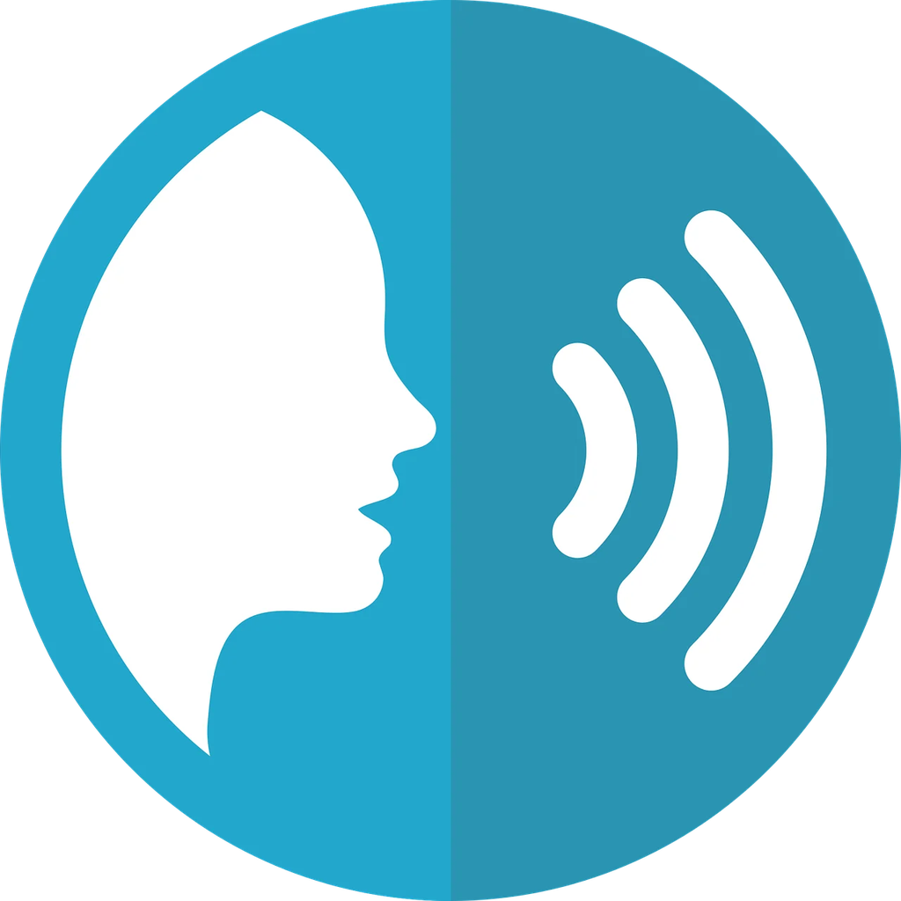

# Kiku

**Offline dictation.** Hold a key, speak, and the text appears where you're typing.

Speech recognition runs entirely on your own machine. No account, no cloud, no
telemetry. The network is touched exactly twice: once to download the speech model,
and — if you leave it on — once a day to check whether a newer version exists.

```
Right Ctrl           hold to talk         (Right Option on macOS)
Right Ctrl, twice    start hands-free; tap again to stop
Ctrl + Alt + Space   toggle, if you prefer a chord
Escape               cancel without transcribing
```

One key is easier to hold than a chord, and no operating system uses Right Ctrl on its
own. It cannot be registered as a global shortcut — no platform accepts a bare
modifier — so Kiku watches its state instead. It never intercepts the key, so Right
Ctrl keeps working as Ctrl everywhere else, and **pressing any other key while holding
it cancels**, which is what stops Right Ctrl + C from copying *and* dictating.

Mac keyboards have no right Control key, which is why macOS watches Right Option.

Settings offers `F9` / `F10` and a `Ctrl+Shift+Space` chord as alternatives, and every
shortcut is rebindable.

## Installing

Kiku is not code-signed. That is a deliberate trade: signing costs money every year
and buys nothing for a tool you can build yourself from this repository. It does mean
each operating system will warn you once.

**Linux** — download the `.AppImage`, make it executable, run it.

```sh
chmod +x Kiku_*.AppImage
./Kiku_*.AppImage
```

Or install the `.deb`:

```sh
sudo apt install ./Kiku_*_amd64.deb
```

X11 only for now. Wayland needs portal-based shortcuts and `uinput` for pasting, which
is not built yet.

**Windows** — run the installer. SmartScreen will show "Windows protected your PC";
choose **More info → Run anyway**.

**macOS (Apple Silicon)** — open the `.dmg` and drag Kiku to Applications. The first
launch is refused; open **System Settings → Privacy & Security**, scroll down, and
choose **Open Anyway**.

macOS also asks for two permissions, both under Privacy & Security:

- **Microphone** — to hear you.
- **Accessibility** — to paste into other applications. Without it, transcripts still
  reach your clipboard and you paste them yourself.

## Speech models

Two, both English, both downloaded on first run and then kept. Settings lets you
download either, switch between them, and delete one to get the disk space back.

| | Size | |
|---|---|---|
| **Standard** | 631 MB | The default. Parakeet TDT 0.6B v2 — around fifteen times faster than real time on four cores, and six times faster on one |
| **Compact** | 455 MB | Parakeet TDT 110M. Lighter on the processor and on disk, a little less accurate |

## What it needs

- Disk space for one model, from the table above.
- A CPU from roughly the last decade. There is no GPU requirement at all — that is why
  Kiku uses Parakeet rather than Whisper.

## Continuous integration

Every push to `master` builds installers for all three platforms and uploads them as
workflow artefacts, downloadable from the run for 30 days — so there is always
something to test without building locally. Pushing a `v*` tag builds the same
installers and attaches them to a **draft** GitHub release, so publishing stays a
decision rather than a side effect.

A separate fast check runs lint, types, clippy and tests on every push and pull
request.

## Building it yourself

```sh
npm install
npm run app          # development
npm run app:build    # bundle for this platform
```

Requires Rust and Node. On Debian or Ubuntu you will also need the WebKitGTK
development packages:

```sh
sudo apt install libwebkit2gtk-4.1-dev libasound2-dev build-essential curl file \
                 libssl-dev libayatana-appindicator3-dev librsvg2-dev
```

Useful commands:

```sh
cd src-tauri
cargo test                       # unit tests, no model or network needed
cargo test export_bindings       # regenerate src/lib/ipc/bindings.ts from Rust
KIKU_TEST_NETWORK=1 cargo test   # includes the download test
cargo clippy --all-targets -- -D warnings
```

## How it works

| | |
|---|---|
| Recognition | [NVIDIA Parakeet](https://huggingface.co/nvidia/parakeet-tdt-0.6b-v2) through [sherpa-onnx](https://github.com/k2-fsa/sherpa-onnx), CPU only |
| Sound | Two short cues in `assets/sounds/` — listening started and stopped — embedded in the binary. Switchable off in Settings |
| Privacy | No account, no telemetry, no audio ever written to disk |
| Shell | Tauri 2 · Rust · React · TypeScript · Tailwind |
| Storage | SQLite, in your platform's application data directory |
| History | Text only. Audio is never written to disk |

Design notes and the build log live in [`docs/`](docs/) — `SCOPE.md` for what Kiku is
and is not, `PLAN.md` for how it was built, `CHUNK-0-RESULTS.md` for the measurements
that decided the engine.

## Attribution

Speech recognition uses NVIDIA's Parakeet model, licensed
[CC-BY-4.0](https://creativecommons.org/licenses/by/4.0/). Model conversion to ONNX by
the [sherpa-onnx](https://github.com/k2-fsa/sherpa-onnx) project.

## Licence

MIT.
